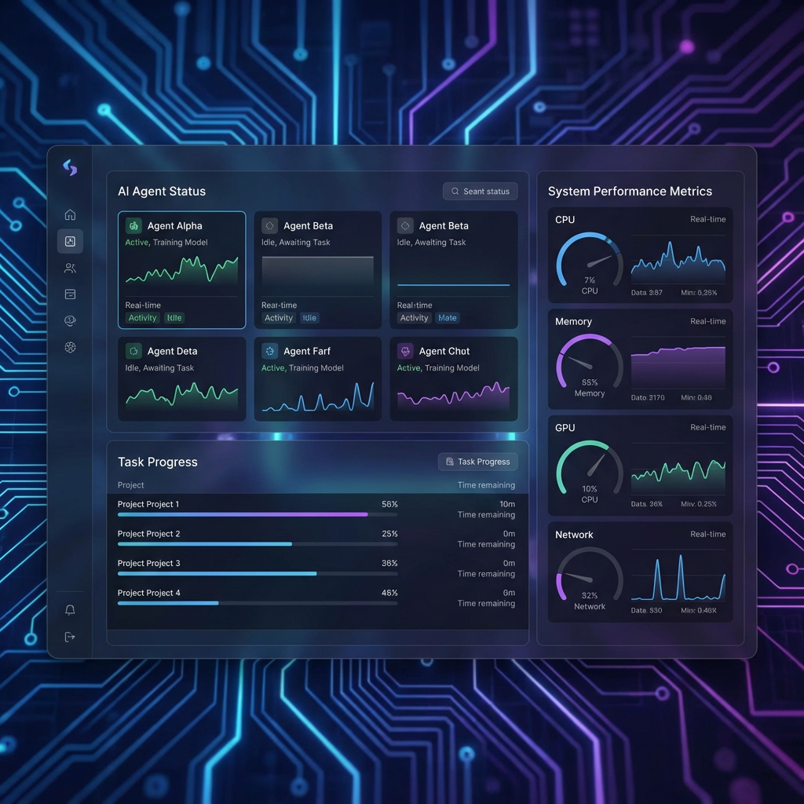
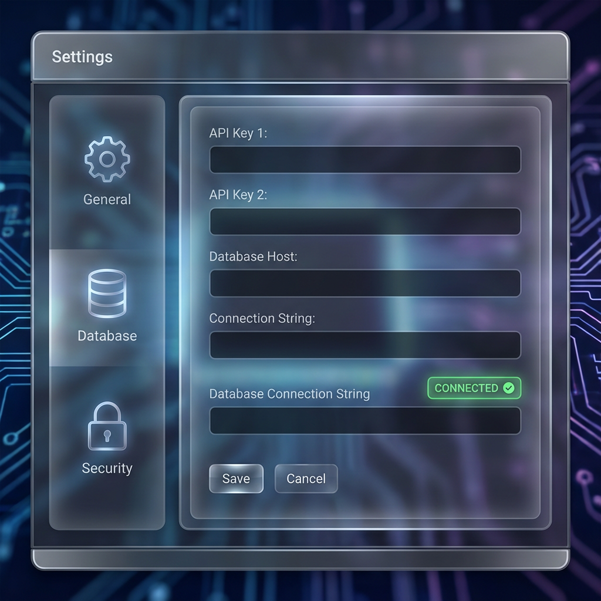

# 🚀 MarkOS-AgentFlow Enterprise v2.3

[English](./README.md) | [简体中文](./README.md#简体中文)

---

## 🌟 Overview / 项目概览

**MarkOS-AgentFlow** is a production-grade orchestration platform designed to automate the software delivery lifecycle (**PM -> Dev -> QA**) using specialized AI agents. It features a robust state machine for task execution, artifact handoffs, and a high-end "Frosted Glass" visual dashboard.

**MarkOS-AgentFlow** 是一个生产级的编排平台，旨在通过专门的 AI Agent 自动化软件交付生命周期（**PM -> 开发 -> 测试**）。它具备强大的任务执行状态机、产物交接机制，以及极致视觉体验的“磨砂玻璃”管理面板。

---

## 📸 Visual Showcase / 视觉展示

### Dashboard / 控制面板

> *The "Frosted Glass" UI provides a high-transparency, modern interface for real-time monitoring.*
> *“磨砂玻璃” UI 为实时监控提供了一个高透明度、现代化的交互界面。*

### Settings / 设置面板

> *3-UI style configuration panel for seamless environment management.*
> *3-UI 风格配置面板，实现无缝的环境管理。*

---

## 🎥 Video Demonstration / 视频演示

[](https://www.youtube.com/watch?v=placeholder)
> *Click to watch the full walkthrough of the automated PM -> Dev -> QA workflow.*
> *点击观看自动化的 PM -> 开发 -> 测试工作流完整演示。*

---

## ⚡️ Quick Start / 快速开始

### 1. Clone / 克隆项目
```bash
git clone https://github.com/mktt-ai-global/MarkOS-AgentFlow.git
cd MarkOS-AgentFlow
```

### 2. One-Click Install / 一键部署
```bash
chmod +x install.sh && ./install.sh
```

🎉 **Success! / 部署成功！** 
- **Dashboard / 面板**: [http://localhost:3000](http://localhost:3000)
- **API Docs / 文档**: [http://localhost:8000/docs](http://localhost:8000/docs)
- **Health / 状态**: [http://localhost:8000/health](http://localhost:8000/health)

---

## ✨ Key Features / 核心亮点

### 🇺🇸 English
- **One-Click Deployment**: Built-in `install.sh` automates Docker, .env, and container orchestration.
- **Enterprise UI/UX**: Next.js 16 + Tailwind 4 powered "Frosted Glass" interface.
- **3-UI Configuration**: Visual panel for DB, Redis, API keys, and Agent profiles.
- **Multi-Agent Chain**: Orchestration of PM, Architect, Dev, and QA roles with strict handoffs.
- **Robust State Machine**: Tasks follow `Pending -> Running -> Review -> Done` lifecycle.
- **Production Grade**: Unified monorepo with strict TS mode, comprehensive logging, and security audits.

### 🇨🇳 简体中文
- **一键部署**：内置 `install.sh` 脚本，自动处理 Docker、环境变量与容器编排。
- **极致视觉**：采用 Next.js 16 + Tailwind 4 打造的高端“磨砂玻璃”通透感 UI。
- **可视化配置**：3-UI 风格配置面板，直观管理数据库、Redis、API 密钥与 Agent 设置。
- **多 Agent 协作链**：自动编排 PM、架构师、开发与 QA 角色，严格管理交付产物。
- **强大状态机**：任务严格遵循 `待处理 -> 运行中 -> 审核中 -> 已完成` 的生命周期。
- **生产级标准**：统一的 Monorepo 结构、严格的 TS 模式、详尽的日志与安全审计规范。

---

## 🛠 Tech Stack / 技术栈

| Layer / 层级 | Technology / 技术 |
| :--- | :--- |
| **Frontend / 前端** | Next.js 16.2.1, React 19.2.4, Tailwind CSS 4.2.2, Zustand 5 |
| **Backend / 后端** | FastAPI (Python 3.12+), SQLModel, SQLAlchemy, Pydantic v2 |
| **Storage / 存储** | PostgreSQL 16 (Persistence), Redis 7 (Cache/Queue) |
| **DevOps / 运维** | Docker & Compose, Nginx (Reverse Proxy), Alembic (Migrations) |
| **Quality / 质量** | Pytest, Vitest, Prettier, ESLint, Commitlint |

---

## 📂 Project Structure / 项目结构

```text
.
├── apps/                # Frontend Applications
│   └── dashboard/       # Next.js 16 Admin Panel
├── backend/             # Backend Services
│   ├── app/             # FastAPI Application Logic
│   └── tests/           # Backend Test Suite
├── docker/              # Multi-stage Dockerfiles & Nginx Config
├── docs/                # Detailed Technical Documentation
├── frontend/            # Unified Frontend Root
├── install.sh           # One-Click Deployment Script
└── docker-compose.yml   # Production Container Orchestration
```

---

## 📖 Deep Documentation / 详细文档

- 📐 **Architecture**: [docs/ARCHITECTURE.md](docs/ARCHITECTURE.md)
- 🔌 **API Specification**: [docs/API.md](docs/API.md)
- 🛠 **Development**: [docs/DEVELOPMENT.md](docs/DEVELOPMENT.md)
- 🚢 **Deployment**: [docs/DEPLOYMENT.md](docs/DEPLOYMENT.md)
- 🧪 **Database Schema**: [docs/DATABASE_SCHEMA.md](docs/DATABASE_SCHEMA.md)
- ⚠️ **Troubleshooting**: [docs/TROUBLESHOOTING.md](docs/TROUBLESHOOTING.md)

---

## 🛡 Security & Governance / 安全与治理

Please refer to our [SECURITY.md](SECURITY.md) for vulnerability reporting and [COMPLIANCE.md](docs/COMPLIANCE.md) for enterprise governance standards.

请参阅我们的 [SECURITY.md](SECURITY.md) 了解漏洞报告流程，以及 [COMPLIANCE.md](docs/COMPLIANCE.md) 了解企业治理标准。

---

## 📄 License / 开源协议

This project is licensed under the **MIT License**. See the [LICENSE](LICENSE) file for details.

本项目采用 **MIT 协议**。详情请参阅 [LICENSE](LICENSE) 文件。

---

> Created with ❤️ by the **MarkOS-AgentFlow Team**.
> **MarkOS-AgentFlow 团队** 倾力打造。
